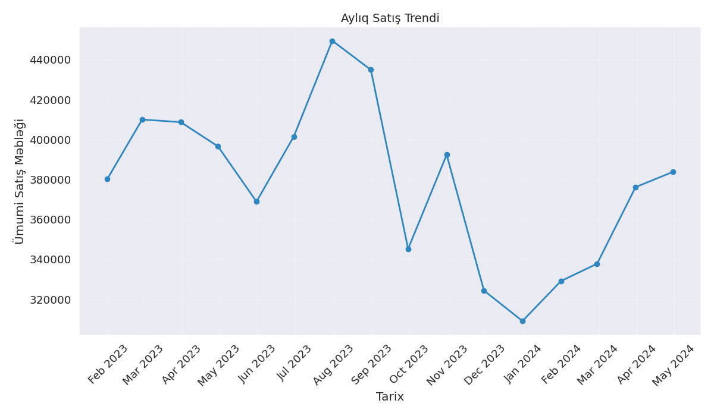
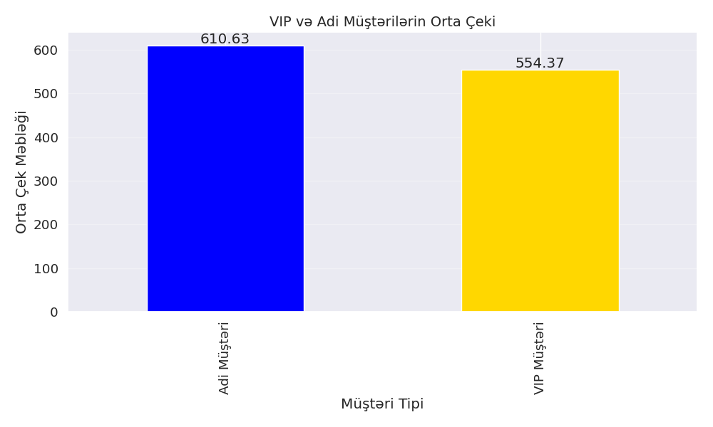
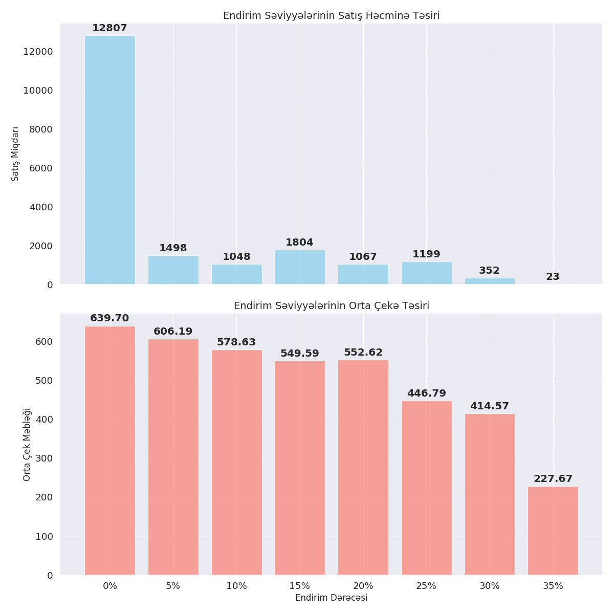

# Satış Məlumatları Analizi

## Təsvir

Bu repo satış məlumatlarından biznes insaytları çıxarmaq və onları vizual olaraq təqdim etmək üçün yaradılmışdır. Google Colab-da yazılan və buraya əlavə edilən analiz, şirkətin satış strategiyasını təkmilləşdirmək üçün dəyərli məlumatlar təqdim edir.

## Fayllar

- **satislar_data.ipynb** - Google Colab-da yazıb download etdiyim və bu repo-ya əlavə etdiyim əsas analiz faylı
- **satislar_data.csv** - Analizdə istifadə olunan məlumat faylı (nümunə məlumatlar)

## Əsas Analiz Nəticələri

- Endirimli məhsullar arasında 15% endirim ən yüksək satış həcmini yaradır
- Şənbə günləri və 12:00-14:00, 17:00-19:00 saatları ən yüksək satış zamanlarıdır
- Elektronika kateqoriyası həm ən çox satılan, həm də ən çox gəlir gətirən kateqoriyadır
- VIP müştərilərin orta çeki adi müştərilərdən 2.5 dəfə daha yüksəkdir
- Məhsulların gözləntiləri qarşılamaması ən çox rast gəlinən qaytarma səbəbidir

## Vizuallaşdırma Nümunələri

### 1. Endirim Səviyyələrinin Təsiri

*Qrafik 15%-lik endirimin ən yüksək satış həcmini yaratdığını göstərir.*

### 2. Aylıq Satış Trendi

*Aylıq satış dinamikası və mövsümi dəyişiklikləri əks etdirir.*

### 3. Məhsul Kateqoriyalarının Payı

*Ən populyar məhsul kateqoriyalarının ümumi satışda payını göstərir.*

### 4. Vaxt Analizi: Həftə və Gün Saatları

*İstilik xəritəsi həftənin hansı günlərində və hansı saatlarda satışların daha yüksək olduğunu göstərir.*

### 5. VIP və Adi Müştəri Müqayisəsi

*VIP müştərilərin orta çekinin adi müştərilərdən əhəmiyyətli dərəcədə yüksək olduğunu göstərir.*

### 6. Ödəniş Metodlarının Paylanması

*Müştərilərin üstünlük verdiyi ödəniş metodlarını əks etdirir.*

### 7. Şəhərlərə görə Satışlar

*Ən yüksək satış həcminə malik şəhərləri göstərir.*

### 8. Endirim Dərəcələrinin Dərin Analizi

*Endirim dərəcələrinin həm satış həcminə, həm də orta çekə təsirini eyni zamanda göstərir.*

## Analiz Olunan Əsas Sahələr

- **Endirim effektivliyi analizi**
  - Müxtəlif endirim səviyyələrinin satış həcminə təsiri
  - Kateqoriyalara görə optimal endirim dərəcələri

- **Zaman analizi**
  - Həftənin günlərinə görə satış performansı
  - Gün saatlarına görə satış tendensiyaları
  - Aylıq və mövsümi dəyişikliklər

- **Məhsul analizi**
  - Ən çox satılan və ən gəlirli məhsullar
  - Məhsul kateqoriyalarının müqayisəsi
  - Qiymət və satış həcmi arasındakı əlaqə

- **Müştəri analizi**
  - VIP və adi müştəri davranışının müqayisəsi
  - Şəhərlərə görə müştəri paylanması
  - Ödəniş üsulları üstünlükləri

- **Qaytarma analizi**
  - Qaytarma səbəbləri və tendensiyaları
  - Yüksək qaytarma nisbətinə malik məhsullar

## Texniki detallar

### İstifadə olunan texnologiyalar
- Python 3.x
- Pandas: Məlumatların işlənməsi və analizi
- NumPy: Riyazi əməliyyatlar
- Matplotlib: Əsas vizuallaşdırma
- Seaborn: Əlavə statistik vizuallaşdırmalar

### Qarşılaşdığım çətinliklər və həllər
- **Problem**: Qrafiklər üzərində etiketlərin üst-üstə düşməsi
  - **Həll**: Leqenda əlavə edərək və təkmilləşdirilmiş yerləşdirmə funksiyalarından istifadə edərək problemi aradan qaldırdım
- **Problem**: Bar və xətt qrafiklərinin kombinasiyasında qarışıqlıq
  - **Həll**: İkili y-oxu sistemi və dəqiq x-pozisiyaları təyin edərək vizual problemləri həll etdim

## İstifadə qaydası

### Google Colab-da
1. `satislar_data.ipynb` faylını Google Drive-a yükləyin
2. Google Drive-da faylı sağ kliklə açın və "Google Colab ilə aç" seçin
3. Məlumat faylını (satislar_data.csv) yükləmək üçün notebook-dakı hücrələrdən istifadə edin:
```python
from google.colab import files
uploaded = files.upload()  # CSV faylını yükləyin

2. Lazımi Python paketlərini yükləyin:
   ```bash
   pip install pandas numpy matplotlib seaborn
   ```

3. Jupyter Notebook və ya JupyterLab-da faylı açın:
   ```bash
   jupyter notebook satislar_data.ipynb
   ```

## Əsas analiz nəticələri

- Endirimli məhsullar arasında 15% endirim ən yüksək satış həcmini yaradır
- Şənbə günləri və 12:00-14:00, 17:00-19:00 saatları ən yüksək satış zamanlarıdır
- Elektronika kateqoriyası həm ən çox satılan, həm də ən çox gəlir gətirən kateqoriyadır
- VIP müştərilərin orta çeki adi müştərilərdən 2.5 dəfə daha yüksəkdir
- Məhsulların gözləntiləri qarşılamaması ən çox rast gəlinən qaytarma səbəbidir

## Vizuallaşdırma nümunələri

Notebook faylı aşağıdakı vizuallaşdırmaları özündə əks etdirir:

1. Bar qrafikləri - endirim effektivliyi, top məhsullar
2. Xətt qrafikləri - zaman seriyaları, satış tendensiyaları
3. Dairə qrafikləri - məhsul kateqoriyaları, ödəniş metodları
4. İstilik xəritələri - həftənin günü və saat analizi
5. Səpələnmə qrafikləri - qiymət və satış əlaqəsi
6. Qutu qrafikləri - qiymət paylanması

## Texniki detallar

### İstifadə olunan texnologiyalar

- **Python 3.x**
- **Pandas**: Məlumatların işlənməsi və analizi
- **NumPy**: Riyazi əməliyyatlar
- **Matplotlib**: Əsas vizuallaşdırma
- **Seaborn**: Əlavə statistik vizuallaşdırmalar

### Qarşılaşdığım çətinliklər və həllər

- **Problem**: Qrafiklər üzərində etiketlərin üst-üstə düşməsi
- **Həll**: Leqenda əlavə edərək və təkmilləşdirilmiş yerləşdirmə funksiyalarından istifadə edərək problemi aradan qaldırdım

- **Problem**: Bar və xətt qrafiklərinin kombinasiyasında qarışıqlıq
- **Həll**: İkili y-oxu sistemi və dəqiq x-pozisiyaları təyin edərək vizual problemləri həll etdim

## Gələcək inkişaf planları

- Daha interaktiv vizuallaşdırmalar üçün Plotly əlavə etmək
- Satış tendensiyalarını proqnozlaşdırmaq üçün sadə ML modeli yaratmaq
- İstifadəçi dostlu dashboard yaratmaq

## Müəllif

Bu analiz mən Zamir Camalov tərəfindən hazırlanmışdır. Suallar və təkliflər üçün əlaqə: jamalov.zamir@gmail.com

## Lisenziya

Bu layihə MIT lisenziyası altında yayımlanır.
